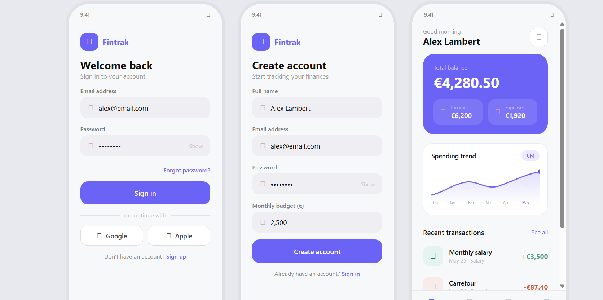
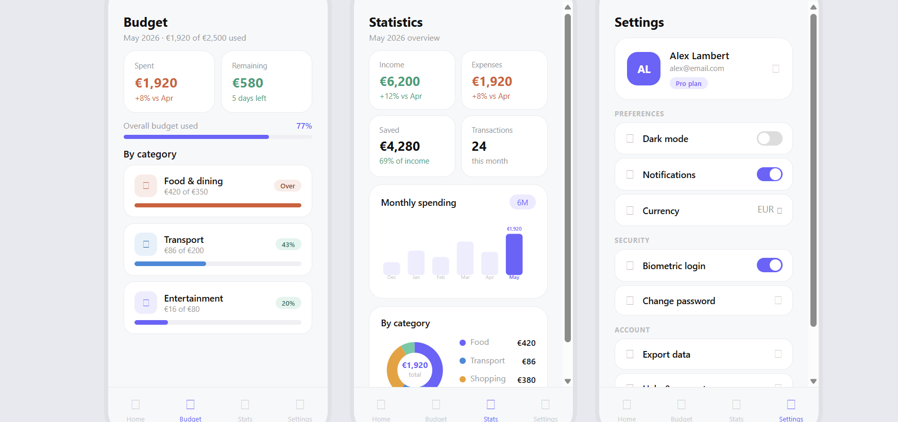
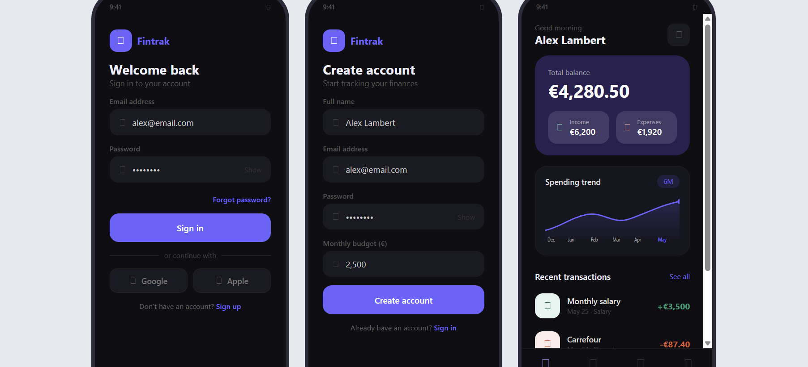
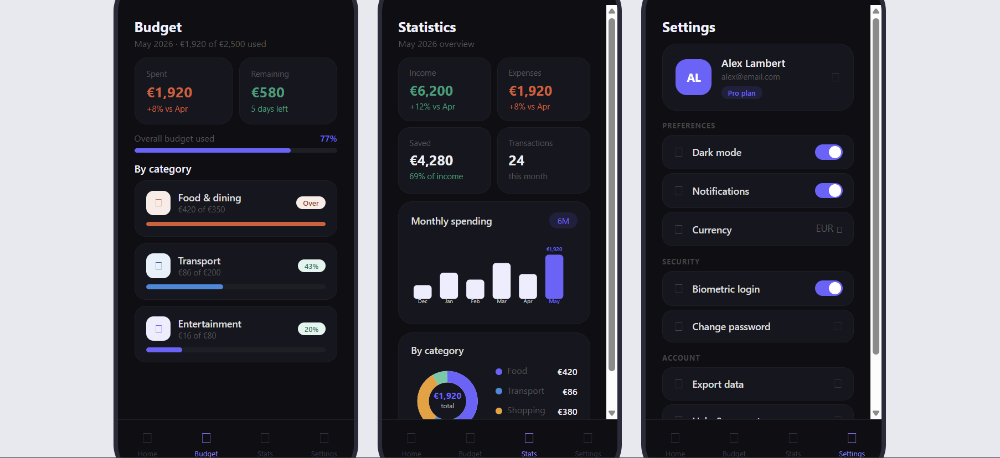

# 💰 FinTak

<p align="center">
  
</p>

<p align="center">
  <b>A modern personal finance tracker built with Flutter.</b>
</p>

<p align="center">
Track expenses, manage budgets, visualize spending trends, and stay on top of your finances—all from a beautiful, fully offline-first application.
</p>

---

## ✨ Overview

FinTak is a Flutter application for managing personal finances entirely on-device. It allows users to record income and expenses, create category budgets, and analyze spending habits through interactive charts.

The application follows the **MVVM (Model–View–ViewModel)** architecture and uses **Riverpod** for state management, **Firebase Authentication** for secure sign-in, and **SharedPreferences** for local data persistence.

Since all financial data is stored locally, no cloud database is required.

---

# 📱 Screenshots

## 🌞 Light Mode

<p align="center">
  
  
</p>

## 🌚 Dark Mode

<p align="center">
  
  
</p>

---

# 🚀 Features

- 🔐 **Authentication**
  - Secure email/password sign up and login with Firebase Authentication.

- 🏠 **Dashboard**
  - View current balance, recent transactions, and quick financial insights.

- 💸 **Transaction Management**
  - Add income and expenses.
  - Browse complete transaction history.

- 📊 **Budget Tracking**
  - Create budgets for different spending categories.
  - Monitor budget progress.

- 📈 **Statistics**
  - Interactive spending and income charts powered by **fl_chart**.

- 🌗 **Theme Support**
  - Beautiful Light and Dark themes.

- ⚙️ **Settings**
  - Manage preferences and account information.

- 📴 **Offline First**
  - Financial data is stored locally using SharedPreferences.
  - No Firestore database required.

---

# 🛠 Tech Stack

| Category | Technology |
|-----------|------------|
| Framework | Flutter |
| Language | Dart |
| Architecture | MVVM |
| State Management | Riverpod |
| Authentication | Firebase Authentication |
| Local Storage | SharedPreferences |
| Navigation | Go Router |
| Charts | fl_chart |
| Utilities | uuid, intl |

---

# 📂 Project Structure

```text
lib/
│
├── core/
│   ├── constants/
│   ├── providers/
│   ├── router/
│   └── theme/
│
├── data/
│   └── datasources/
│
├── features/
│   ├── auth/
│   ├── home/
│   ├── budget/
│   ├── stats/
│   └── settings/
│
├── shared/
│   └── widgets/
│
├── firebase_options.dart
└── main.dart
```

### Feature Architecture

Each feature follows the same MVVM structure:

```text
feature/
│
├── screens/
├── viewmodels/
└── widgets/
```

This keeps UI, business logic, and reusable widgets cleanly separated and easy to maintain.

---

# 🚀 Getting Started

## Prerequisites

- Flutter SDK (Dart ^3.12.1)
- Android Studio / VS Code
- Firebase Project
- FlutterFire CLI

---

## Installation

### Clone the repository

```bash
git clone https://github.com/Kiyanjr/fintak.git
```

### Navigate into the project

```bash
cd fintak
```

### Install dependencies

```bash
flutter pub get
```

### Run the application

```bash
flutter run
```

---

# 🔥 Firebase Setup

Generate the required Firebase configuration file:

```bash
dart pub global activate flutterfire_cli

flutterfire configure
```

> **Note**
>
> FinTak only uses **Firebase Authentication**.
>
> Financial data is stored locally with **SharedPreferences**, so **Firestore is not required**.

---

# 🎯 Why FinTak?

- 📱 Clean and responsive Flutter UI
- 🧱 MVVM architecture
- ⚡ Riverpod state management
- 🌗 Complete Light & Dark theme support
- 📊 Beautiful charts
- 🔐 Secure authentication
- 📴 Offline-first experience
- ♻️ Reusable and scalable codebase

---
## 📥 Download APK

[⬇️ Download Latest APK](https://github.com/Kiyanjr/fintak/releases/latest)

  
# 👨‍💻 Author

**Kiyanjr**

GitHub: https://github.com/Kiyanjr

---

## ⭐ Support

If you found this project helpful, consider giving it a **⭐ Star** on GitHub.
Built by Kiyanjr
